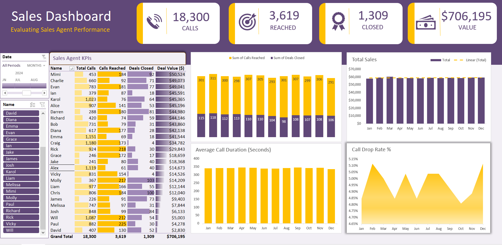

# Sales Dashboard

An Excel-based dashboard designed to track and analyze sales performance, revenue, and KPIs.

## Preview

## Files
- **Sales Dashboard.xlsx** — the main dashboard file.

## Features
- User-friendly Excel interface.  
- Visual dashboards for sales performance tracking.  
- Customizable metrics and charts.  
- Easy to update with new sales data.

## How to Use
1. Click on **Sales Dashboard.xlsx** in this repository.  
2. Select **Download raw file**.  
3. Open the file in **Microsoft Excel**.  
4. Explore the dashboard to view sales KPIs and insights.

## About the Author
Created by **Omolabake Adesona**.  
- 📧 Email: adesonaomolabake09@gmail.com  
- 🔗 LinkedIn: [linkedin.com/in/omolabake-adesona](https://www.linkedin.com/in/omolabake-adesona/)
